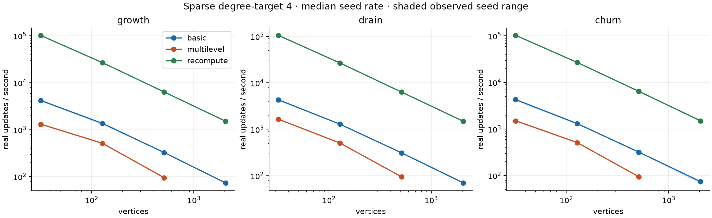
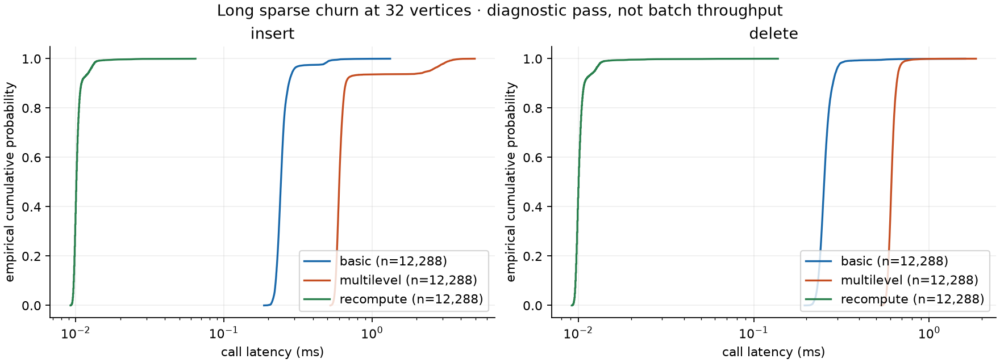
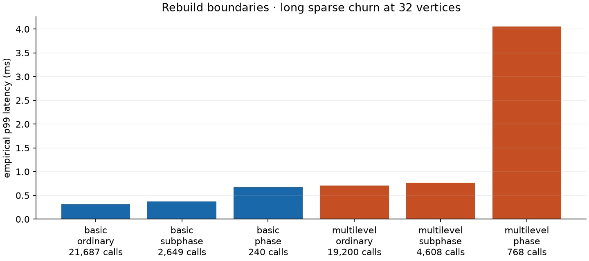

# Axiom dynamic-update performance

888/990 cases completed and passed correctness checks. Rates are machine- and workload-specific, not universal algorithmic bounds.

## Environment

- 2026-10-01T08:13:33Z: Python 3.14.7, macOS-26.7.1-arm64-arm-64bit-Mach-O; hardware Apple M3 Pro, 19327352832, 12; commit `a227d69529b634862c747027a10f13f0a00af5ad`; dirty=True; sizes=[32, 128, 512], updates=32, repetitions=5, timeout=8.0s.
- 2026-10-01T08:42:07Z: Python 3.14.7, macOS-26.7.1-arm64-arm-64bit-Mach-O; hardware Apple M3 Pro, 19327352832, 12; commit `72f510b6d69f3c61ed3cfcd55edaeff7e7d4ceff`; dirty=True; sizes=[32], updates=8192, repetitions=5, timeout=180.0s.
- 2026-10-01T08:46:34Z: Python 3.14.7, macOS-26.7.1-arm64-arm-64bit-Mach-O; hardware Apple M3 Pro, 19327352832, 12; commit `72f510b6d69f3c61ed3cfcd55edaeff7e7d4ceff`; dirty=True; sizes=[128], updates=2048, repetitions=5, timeout=120.0s.
- 2026-10-01T08:50:07Z: Python 3.14.7, macOS-26.7.1-arm64-arm-64bit-Mach-O; hardware Apple M3 Pro, 19327352832, 12; commit `72f510b6d69f3c61ed3cfcd55edaeff7e7d4ceff`; dirty=True; sizes=[2048], updates=32, repetitions=5, timeout=20.0s.

Hardware entries above are CPU model, installed memory in bytes, and logical CPU count on macOS. Source SHA-256 hashes are recorded in each metadata file.

## Real insertion, deletion, and mixed-update rates

Median of the successful seed-specific batch rates, each based on fresh-state timed repetitions after one untimed warmup (normally three seeds and five repetitions). Min–max is observed seed variation, not a confidence interval. The table shows successful seed counts; blank/missing configurations are not zero throughput.

| Vertices | Shape / degree target | Workload | Mode | Calls/trace | Seeds | Updates/s | Seed min–max | Init ms | Traced update peak MiB |
| ---: | --- | --- | --- | ---: | ---: | ---: | --- | ---: | ---: |
| 32 | bipartite / 16 | churn | basic | 32 | 3 | 3,513 | 3,350–3,535 | 0.80 | 0.19 |
| 32 | bipartite / 16 | churn | multilevel | 32 | 3 | 981 | 917–985 | 8.08 | 0.53 |
| 32 | bipartite / 16 | churn | recompute | 32 | 3 | 94,792 | 93,125–96,241 | 0.01 | 0.03 |
| 32 | bipartite / 16 | drain | basic | 32 | 3 | 3,325 | 3,216–3,771 | 0.84 | 0.19 |
| 32 | bipartite / 16 | drain | multilevel | 32 | 3 | 1,050 | 1,029–1,057 | 8.03 | 0.52 |
| 32 | bipartite / 16 | drain | recompute | 32 | 3 | 98,348 | 97,611–98,512 | 0.01 | 0.03 |
| 32 | bipartite / 16 | growth | basic | 32 | 3 | 3,404 | 3,356–3,693 | 0.80 | 0.19 |
| 32 | bipartite / 16 | growth | multilevel | 32 | 3 | 975 | 942–999 | 8.06 | 0.55 |
| 32 | bipartite / 16 | growth | recompute | 32 | 3 | 92,586 | 91,954–93,887 | 0.01 | 0.03 |
| 32 | dense / 16 | churn | basic | 32 | 3 | 2,292 | 2,258–2,482 | 3.93 | 0.23 |
| 32 | dense / 16 | churn | multilevel | 32 | 3 | 92 | 86–92 | 81.71 | 1.08 |
| 32 | dense / 16 | churn | recompute | 32 | 3 | 82,324 | 81,824–82,919 | 0.01 | 0.04 |
| 32 | dense / 16 | drain | basic | 32 | 3 | 2,441 | 2,408–2,520 | 3.91 | 0.22 |
| 32 | dense / 16 | drain | multilevel | 32 | 3 | 96 | 95–114 | 81.27 | 1.04 |
| 32 | dense / 16 | drain | recompute | 32 | 3 | 84,257 | 36,577–84,386 | 0.02 | 0.03 |
| 32 | dense / 16 | growth | basic | 32 | 3 | 2,294 | 2,281–2,358 | 3.85 | 0.24 |
| 32 | dense / 16 | growth | multilevel | 32 | 3 | 72 | 70–75 | 81.62 | 1.24 |
| 32 | dense / 16 | growth | recompute | 32 | 3 | 81,244 | 80,936–82,289 | 0.02 | 0.04 |
| 32 | sparse / 4 | churn | basic | 32 | 3 | 4,280 | 4,041–4,359 | 0.33 | 0.13 |
| 32 | sparse / 4 | churn | multilevel | 32 | 3 | 1,502 | 1,457–1,557 | 2.25 | 0.36 |
| 32 | sparse / 4 | churn | recompute | 32 | 3 | 102,825 | 101,173–103,171 | 0.01 | 0.02 |
| 32 | sparse / 4 | drain | basic | 32 | 3 | 4,336 | 4,125–4,353 | 0.32 | 0.13 |
| 32 | sparse / 4 | drain | multilevel | 32 | 3 | 1,654 | 1,640–1,687 | 2.27 | 0.31 |
| 32 | sparse / 4 | drain | recompute | 32 | 3 | 105,683 | 104,009–106,033 | 0.01 | 0.02 |
| 32 | sparse / 4 | growth | basic | 32 | 3 | 4,176 | 4,080–4,356 | 0.33 | 0.16 |
| 32 | sparse / 4 | growth | multilevel | 32 | 3 | 1,310 | 1,280–1,334 | 2.28 | 0.41 |
| 32 | sparse / 4 | growth | recompute | 32 | 3 | 101,776 | 99,740–102,977 | 0.01 | 0.02 |
| 32 | sparse / 16 | churn | basic | 32 | 3 | 2,293 | 2,278–2,470 | 3.93 | 0.23 |
| 32 | sparse / 16 | churn | multilevel | 32 | 3 | 92 | 86–93 | 81.89 | 1.08 |
| 32 | sparse / 16 | churn | recompute | 32 | 3 | 82,884 | 80,444–83,315 | 0.01 | 0.04 |
| 32 | sparse / 16 | drain | basic | 32 | 3 | 2,453 | 2,370–2,521 | 3.85 | 0.22 |
| 32 | sparse / 16 | drain | multilevel | 32 | 3 | 96 | 96–113 | 81.44 | 1.04 |
| 32 | sparse / 16 | drain | recompute | 32 | 3 | 83,861 | 82,492–84,045 | 0.02 | 0.03 |
| 32 | sparse / 16 | growth | basic | 32 | 3 | 2,283 | 2,257–2,332 | 3.84 | 0.24 |
| 32 | sparse / 16 | growth | multilevel | 32 | 3 | 72 | 70–75 | 82.00 | 1.24 |
| 32 | sparse / 16 | growth | recompute | 32 | 3 | 80,927 | 76,062–81,990 | 0.02 | 0.04 |
| 32 | star / 2 | churn | basic | 32 | 3 | 4,119 | 4,088–4,125 | 0.40 | 0.13 |
| 32 | star / 2 | churn | multilevel | 32 | 3 | 2,043 | 2,039–2,047 | 0.61 | 0.27 |
| 32 | star / 2 | churn | recompute | 32 | 3 | 131,170 | 125,572–134,219 | 0.01 | 0.01 |
| 32 | star / 2 | drain | basic | 15 | 3 | 4,152 | 4,097–4,159 | 0.39 | 0.12 |
| 32 | star / 2 | drain | multilevel | 15 | 3 | 2,158 | 2,149–2,174 | 0.60 | 0.20 |
| 32 | star / 2 | drain | recompute | 15 | 3 | 140,133 | 138,090–141,121 | 0.01 | 0.01 |
| 32 | star / 2 | growth | basic | 16 | 3 | 4,031 | 4,004–4,046 | 0.38 | 0.14 |
| 32 | star / 2 | growth | multilevel | 16 | 3 | 2,101 | 2,101–2,103 | 0.60 | 0.22 |
| 32 | star / 2 | growth | recompute | 16 | 3 | 132,688 | 131,733–133,472 | 0.01 | 0.01 |
| 128 | bipartite / 16 | churn | basic | 32 | 3 | 894 | 828–903 | 3.03 | 0.91 |
| 128 | bipartite / 16 | churn | multilevel | 32 | 3 | 188 | 183–190 | 331.63 | 2.18 |
| 128 | bipartite / 16 | churn | recompute | 32 | 3 | 19,195 | 18,522–19,578 | 0.06 | 0.16 |
| 128 | bipartite / 16 | drain | basic | 32 | 3 | 866 | 837–935 | 3.07 | 0.87 |
| 128 | bipartite / 16 | drain | multilevel | 32 | 3 | 187 | 183–187 | 332.19 | 2.17 |
| 128 | bipartite / 16 | drain | recompute | 32 | 3 | 19,141 | 18,809–19,668 | 0.06 | 0.16 |
| 128 | bipartite / 16 | growth | basic | 32 | 3 | 905 | 822–955 | 3.07 | 0.94 |
| 128 | bipartite / 16 | growth | multilevel | 32 | 3 | 188 | 180–190 | 330.02 | 2.23 |
| 128 | bipartite / 16 | growth | recompute | 32 | 3 | 19,125 | 18,274–19,683 | 0.07 | 0.16 |
| 128 | dense / 64 | churn | basic | 32 | 3 | 280 | 278–281 | 136.53 | 2.78 |
| 128 | dense / 64 | churn | recompute | 32 | 3 | 12,162 | 12,050–12,194 | 0.12 | 0.31 |
| 128 | dense / 64 | drain | basic | 32 | 3 | 279 | 269–285 | 137.68 | 2.77 |
| 128 | dense / 64 | drain | recompute | 32 | 3 | 12,106 | 11,975–12,136 | 0.12 | 0.31 |
| 128 | dense / 64 | growth | basic | 32 | 3 | 277 | 276–286 | 137.66 | 2.78 |
| 128 | dense / 64 | growth | recompute | 32 | 3 | 12,154 | 12,034–12,184 | 0.12 | 0.31 |
| 128 | sparse / 4 | churn | basic | 32 | 3 | 1,302 | 1,288–1,346 | 1.25 | 0.45 |
| 128 | sparse / 4 | churn | multilevel | 32 | 3 | 511 | 506–514 | 2.70 | 0.88 |
| 128 | sparse / 4 | churn | recompute | 32 | 3 | 26,842 | 26,287–26,895 | 0.04 | 0.07 |
| 128 | sparse / 4 | drain | basic | 32 | 3 | 1,289 | 1,284–1,296 | 1.26 | 0.44 |
| 128 | sparse / 4 | drain | multilevel | 32 | 3 | 506 | 505–513 | 2.74 | 0.85 |
| 128 | sparse / 4 | drain | recompute | 32 | 3 | 26,855 | 26,682–26,947 | 0.04 | 0.07 |
| 128 | sparse / 4 | growth | basic | 32 | 3 | 1,362 | 1,289–1,367 | 1.26 | 0.45 |
| 128 | sparse / 4 | growth | multilevel | 32 | 3 | 512 | 504–513 | 2.72 | 0.92 |
| 128 | sparse / 4 | growth | recompute | 32 | 3 | 26,801 | 26,479–26,902 | 0.04 | 0.08 |
| 128 | sparse / 16 | churn | basic | 32 | 3 | 814 | 801–828 | 3.68 | 0.94 |
| 128 | sparse / 16 | churn | multilevel | 32 | 3 | 173 | 168–180 | 326.37 | 2.17 |
| 128 | sparse / 16 | churn | recompute | 32 | 3 | 18,614 | 18,462–18,701 | 0.06 | 0.16 |
| 128 | sparse / 16 | drain | basic | 32 | 3 | 815 | 800–826 | 3.72 | 0.89 |
| 128 | sparse / 16 | drain | multilevel | 32 | 3 | 174 | 168–182 | 327.54 | 2.14 |
| 128 | sparse / 16 | drain | recompute | 32 | 3 | 18,743 | 18,568–18,936 | 0.07 | 0.15 |
| 128 | sparse / 16 | growth | basic | 32 | 3 | 824 | 821–859 | 3.73 | 0.97 |
| 128 | sparse / 16 | growth | multilevel | 32 | 3 | 171 | 166–182 | 328.15 | 2.22 |
| 128 | sparse / 16 | growth | recompute | 32 | 3 | 18,331 | 18,217–18,658 | 0.07 | 0.16 |
| 128 | star / 2 | churn | basic | 32 | 3 | 1,259 | 1,252–1,262 | 1.77 | 0.45 |
| 128 | star / 2 | churn | multilevel | 32 | 3 | 671 | 670–674 | 2.60 | 0.68 |
| 128 | star / 2 | churn | recompute | 32 | 3 | 35,419 | 35,165–35,620 | 0.03 | 0.03 |
| 128 | star / 2 | drain | basic | 32 | 3 | 1,270 | 1,269–1,284 | 1.78 | 0.44 |
| 128 | star / 2 | drain | multilevel | 32 | 3 | 668 | 664–670 | 2.61 | 0.68 |
| 128 | star / 2 | drain | recompute | 32 | 3 | 36,822 | 35,754–37,231 | 0.03 | 0.03 |
| 128 | star / 2 | growth | basic | 32 | 3 | 1,276 | 1,267–1,285 | 1.79 | 0.51 |
| 128 | star / 2 | growth | multilevel | 32 | 3 | 661 | 660–664 | 2.63 | 0.73 |
| 128 | star / 2 | growth | recompute | 32 | 3 | 35,362 | 35,216–35,487 | 0.03 | 0.04 |
| 512 | bipartite / 16 | churn | basic | 32 | 3 | 207 | 200–209 | 13.78 | 3.80 |
| 512 | bipartite / 16 | churn | recompute | 32 | 3 | 4,078 | 4,032–4,081 | 0.33 | 0.63 |
| 512 | bipartite / 16 | drain | basic | 32 | 3 | 201 | 190–202 | 13.83 | 3.79 |
| 512 | bipartite / 16 | drain | recompute | 32 | 3 | 4,053 | 4,042–4,079 | 0.31 | 0.62 |
| 512 | bipartite / 16 | growth | basic | 32 | 3 | 203 | 196–210 | 13.76 | 3.82 |
| 512 | bipartite / 16 | growth | recompute | 32 | 3 | 4,075 | 4,070–4,176 | 0.33 | 0.63 |
| 512 | dense / 256 | churn | recompute | 32 | 3 | 774 | 767–793 | 2.41 | 4.19 |
| 512 | dense / 256 | drain | recompute | 32 | 3 | 765 | 759–766 | 2.39 | 4.19 |
| 512 | dense / 256 | growth | recompute | 32 | 3 | 769 | 768–794 | 2.39 | 4.19 |
| 512 | sparse / 4 | churn | basic | 32 | 3 | 318 | 316–319 | 5.47 | 1.91 |
| 512 | sparse / 4 | churn | multilevel | 32 | 3 | 94 | 94–95 | 14.05 | 3.64 |
| 512 | sparse / 4 | churn | recompute | 32 | 3 | 6,433 | 6,377–6,438 | 0.18 | 0.28 |
| 512 | sparse / 4 | drain | basic | 32 | 3 | 311 | 310–320 | 5.46 | 1.89 |
| 512 | sparse / 4 | drain | multilevel | 32 | 3 | 95 | 94–95 | 14.00 | 3.64 |
| 512 | sparse / 4 | drain | recompute | 32 | 3 | 6,334 | 6,289–6,468 | 0.18 | 0.28 |
| 512 | sparse / 4 | growth | basic | 32 | 3 | 326 | 326–327 | 5.45 | 1.96 |
| 512 | sparse / 4 | growth | multilevel | 32 | 3 | 95 | 94–95 | 14.12 | 3.68 |
| 512 | sparse / 4 | growth | recompute | 32 | 3 | 6,379 | 6,378–6,399 | 0.18 | 0.28 |
| 512 | sparse / 16 | churn | basic | 32 | 3 | 176 | 175–181 | 14.76 | 3.94 |
| 512 | sparse / 16 | churn | recompute | 32 | 3 | 4,162 | 4,114–4,185 | 0.34 | 0.64 |
| 512 | sparse / 16 | drain | basic | 32 | 3 | 179 | 178–185 | 14.88 | 3.94 |
| 512 | sparse / 16 | drain | recompute | 32 | 3 | 4,136 | 4,115–4,146 | 0.36 | 0.64 |
| 512 | sparse / 16 | growth | basic | 32 | 3 | 181 | 180–183 | 14.69 | 3.96 |
| 512 | sparse / 16 | growth | recompute | 32 | 3 | 4,087 | 4,039–4,146 | 0.34 | 0.64 |
| 512 | star / 2 | churn | basic | 32 | 3 | 332 | 332–332 | 14.49 | 1.56 |
| 512 | star / 2 | churn | multilevel | 32 | 3 | 160 | 160–161 | 15.99 | 2.68 |
| 512 | star / 2 | churn | recompute | 32 | 3 | 8,961 | 8,848–8,972 | 0.12 | 0.12 |
| 512 | star / 2 | drain | basic | 32 | 3 | 326 | 326–326 | 14.54 | 1.55 |
| 512 | star / 2 | drain | multilevel | 32 | 3 | 160 | 159–160 | 16.08 | 2.65 |
| 512 | star / 2 | drain | recompute | 32 | 3 | 8,955 | 8,935–8,994 | 0.12 | 0.12 |
| 512 | star / 2 | growth | basic | 32 | 3 | 336 | 335–337 | 14.42 | 1.58 |
| 512 | star / 2 | growth | multilevel | 32 | 3 | 161 | 160–161 | 16.14 | 2.73 |
| 512 | star / 2 | growth | recompute | 32 | 3 | 9,024 | 8,934–9,252 | 0.12 | 0.12 |
| 2048 | sparse / 4 | churn | basic | 32 | 3 | 74 | 68–76 | 22.96 | 8.14 |
| 2048 | sparse / 4 | churn | recompute | 32 | 3 | 1,502 | 1,443–1,524 | 0.80 | 1.14 |
| 2048 | sparse / 4 | drain | basic | 32 | 3 | 70 | 68–72 | 23.79 | 8.13 |
| 2048 | sparse / 4 | drain | recompute | 32 | 3 | 1,495 | 1,464–1,517 | 0.78 | 1.13 |
| 2048 | sparse / 4 | growth | basic | 32 | 3 | 73 | 72–74 | 23.45 | 8.15 |
| 2048 | sparse / 4 | growth | recompute | 32 | 3 | 1,514 | 1,487–1,518 | 0.77 | 1.14 |

Growth means absent-edge insertions; drain means present-edge deletions. Both are finite, density-changing traces, not stationary rates. Churn alternates real deletion and insertion. Other workloads, no-ops, initial edge counts and maximum degrees are in `aggregate.csv`; no-op rates must not be compared with real-update rates.

### No-op call rates (not real updates)

Sparse degree-target 4, requested trace length 32. These calls leave the graph unchanged; they are excluded from real-update throughput.

| Vertices | Mode | No-op workload | Successful seeds | Calls/s |
| ---: | --- | --- | ---: | ---: |
| 32 | basic | absent | 3 | 1,841,727 |
| 32 | multilevel | absent | 3 | 1,765,517 |
| 32 | recompute | absent | 3 | 4,465,532 |
| 32 | basic | duplicate | 3 | 2,258,930 |
| 32 | multilevel | duplicate | 3 | 2,188,034 |
| 32 | recompute | duplicate | 3 | 4,770,423 |
| 128 | basic | absent | 3 | 1,781,936 |
| 128 | multilevel | absent | 3 | 1,741,497 |
| 128 | recompute | absent | 3 | 4,363,240 |
| 128 | basic | duplicate | 3 | 2,232,610 |
| 128 | multilevel | duplicate | 3 | 2,181,769 |
| 128 | recompute | duplicate | 3 | 4,388,973 |
| 512 | basic | absent | 3 | 1,714,255 |
| 512 | multilevel | absent | 3 | 1,641,026 |
| 512 | recompute | absent | 3 | 3,878,788 |
| 512 | basic | duplicate | 3 | 2,104,156 |
| 512 | multilevel | duplicate | 3 | 1,989,555 |
| 512 | recompute | duplicate | 3 | 4,106,776 |

## Long traces and tail latency

Latencies are instrumented in a separate pass; counters and classification are read outside each timed call. Quantiles pool calls across seeds for one size, shape, mode, and trace length only. p99 is an empirical sample statistic, not a guaranteed tail bound; fewer than 10,000 samples per operation is explicitly preliminary. Phase categories count a call with both phase and subphase rebuilds as phase.

| Vertices | Mode | Requested calls | Seeds | Updates/s | Insert samples | Insert median / p99 / max ms | Delete samples | Delete median / p99 / max ms | Phases / subphases |
| ---: | --- | ---: | ---: | ---: | ---: | --- | ---: | --- | --- |
| 32 | basic | 8192 | 3 | 4,029 | 12288 | 0.243 / 0.508 / 1.328 | 12288 | 0.252 / 0.337 / 1.608 | 240 / 2649 |
| 32 | multilevel | 8192 | 3 | 1,482 | 12288 | 0.602 / 3.306 / 4.951 | 12288 | 0.610 / 0.726 / 1.851 | 768 / 4608 |
| 32 | recompute | 8192 | 3 | 99,517 | 12288 | 0.010 / 0.014 / 0.064 | 12288 | 0.010 / 0.014 / 0.138 | 0 / 0 |
| 128 | basic | 2048 | 3 | 1,283 | 3072 | 0.759 / 1.319 / 3.568 | 3072 | 0.790 / 1.228 / 2.600 | 9 / 246 |
| 128 | multilevel | 2048 | 3 | 484 | 3072 | 2.037 / 5.161 / 6.402 | 3072 | 2.054 / 2.255 / 2.441 | 48 / 576 |
| 128 | recompute | 2048 | 3 | 26,414 | 3072 | 0.037 / 0.048 / 0.113 | 3072 | 0.037 / 0.047 / 0.107 | 0 / 0 |

## Queries and deletion diagnostics

Deletion diagnostics below use long 32-vertex sparse degree-target 4 churn traces only. Categories observe the matching immediately before deletion; scans are summed rematching-counter deltas.

| Mode | Deletion category | Calls | Median ms | p99 ms | Scans |
| --- | --- | ---: | ---: | ---: | ---: |
| basic | matched | 2,586 | 0.258 | 0.338 | 2,096 |
| basic | unmatched | 9,702 | 0.251 | 0.333 | 0 |
| multilevel | matched | 2,514 | 0.616 | 0.727 | 2,499 |
| multilevel | unmatched | 9,774 | 0.608 | 0.724 | 53 |

- basic, 128-vertex sparse final graph, median query latency: partner 0.17 µs; size 0.08 µs; matching 0.42 µs; stats 0.71 µs; maximal 9.29 µs. Each query has 256 calls per seed; clock and dispatch overhead matter for sub-microsecond calls.
- multilevel, 128-vertex sparse final graph, median query latency: partner 0.17 µs; size 0.08 µs; matching 0.42 µs; stats 0.67 µs; maximal 9.00 µs. Each query has 256 calls per seed; clock and dispatch overhead matter for sub-microsecond calls.

Matched/unmatched deletion samples, scan deltas, and individual boundary labels are retained in `latency.csv` and raw JSON. They are observations, not causal attribution: the same call may pay validation, snapshots, scans, and rebuild work.

## Failures and time limits

A timeout covers the entire case, including initialization, warmup, all throughput repetitions, instrumented latency, and traced memory. It does not establish that one update exceeded the timeout. Failed/timeout cases do not contribute rates.

| Vertices | Shape | Mode | Status | Cases | Reason |
| ---: | --- | --- | --- | ---: | --- |
| 128 | dense | multilevel | timeout | 21 | case exceeded 8 seconds |
| 512 | bipartite | multilevel | timeout | 15 | case exceeded 8 seconds |
| 512 | dense | basic | timeout | 21 | case exceeded 8 seconds |
| 512 | dense | multilevel | timeout | 21 | case exceeded 8 seconds |
| 512 | sparse | multilevel | timeout | 15 | case exceeded 8 seconds |
| 2048 | sparse | multilevel | timeout | 9 | case exceeded 20 seconds |

## Measurement boundaries and limitations

- Prepared traces and initial graph materialization are excluded from update throughput; matcher construction is measured separately. All public API transaction snapshots, invariant checks, graph scans, and rebuilds remain timed.
- Fresh graphs and matchers are used for each repetition and pass. Correctness requires a proper maximal matching, the expected final graph, and identical final matching across repetitions of the same algorithm. Different algorithms need not choose identical matchings. Trace digests are checked across algorithms.
- The baseline recomputes a greedy maximal matching after every real update; it uses the same trace but does not provide Axiom's transactional rollback or hierarchy guarantees. Its speed is a comparison, not an equivalent feature set.
- Tracemalloc peak measures graph plus matcher allocations in a separate update pass after construction. Construction peak is separately in raw JSON. RSS is the isolated process lifetime high-water mark, including imports and prior passes, not current graph-only memory.
- Finite growth/drain traces may end before the requested count. Short traces cannot characterize steady-state rebuild rates or reliable tails; consult actual operation and boundary counts.
- Cases run sequentially, but this is a developer workstation: CPU frequency, thermal state, and unrelated applications were not controlled. No asymptotic complexity claim or statistically rigorous confidence interval follows from these measurements.

Raw JSON includes every batch duration, latency sample, counter, query quantile, memory measurement, trace digest, and correctness certificate. CSV aggregates preserve graph family, size, degree target, workload, mode, sample count, and trace length.
